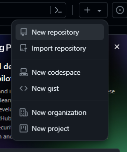
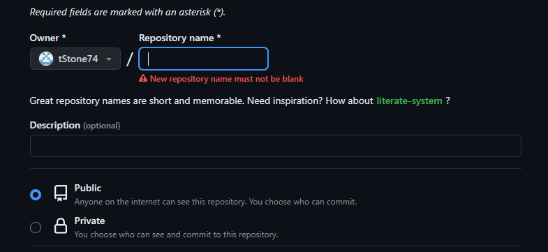
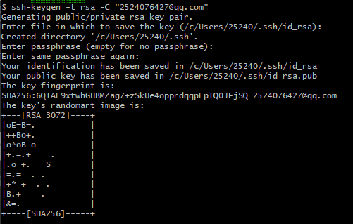
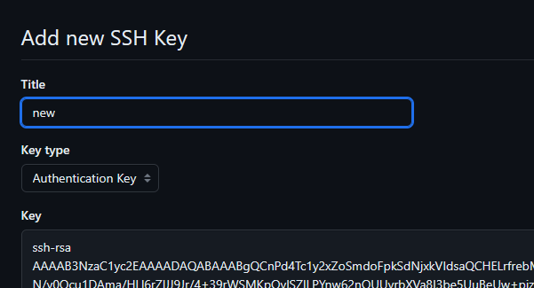
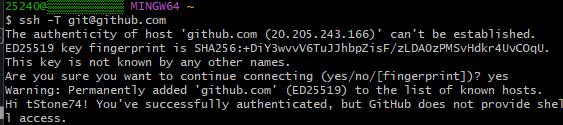
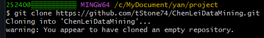
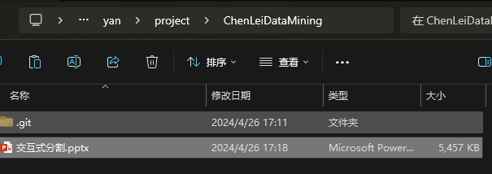
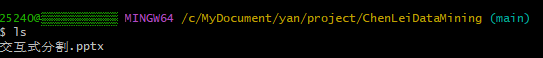

# 数据挖掘
仓库链接：https://github.com/tStone74/ChenLeiDataMining
## 1.注册用户

[GitHub: Let’s build from here · GitHub](https://github.com/)

填写相关信息并注册，我已注册省略相关步骤。

## 2.建立仓库

### 创建github仓库

- 进入主页选择建立新仓库

- 填写仓库名并选择公开

### 获取密钥

- 打开Git Bash，创建一个ssh key 
  

- 使用clip < ~/.ssh/id_rsa.pub命令粘贴ssh密钥，粘贴到GIthub上添加新密钥

- 回到Git Bash，输入命令：$ ssh -T git@github.com ，再输入yes, 出现如下界面，说明链接成功。

### **将github上创建的仓库克隆到本地**

打开指定文件夹Gitbash克隆仓库

## 3.上传文件

把文件复制到本地仓库

查看文件

创建分支master，使用git add命令用于将文件的更改添加到暂存区，使用git commit命令用于将暂存区中的更改提交到本地版本库中，使用git push命令用于将本地仓库中的提交推送到远程代码库

## 4.想学习的技术

平时在学习和生活中经常遇到找不到资源，或者是资源付费，一直想学习使用Python编写程序，自动地从网上获取数据，寻找资源。想学习具体是怎么爬取数据解析数据并进行处理的,以及Scrapy框架使用。
